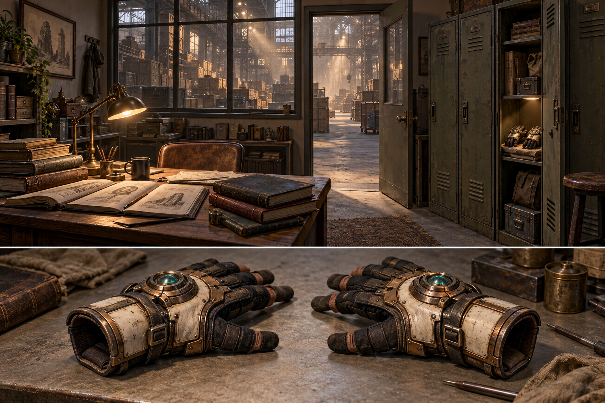

# Restore: the office and the gauntlets

Prototype checkpoint: the first office, tool and clue chains and a 24-part mechanism are now implemented on `opening-discovery`. See [current implementation and limits](../OPENING-IMPLEMENTATION.md). The broader design below remains the target.

Design addition, 10 September 2026. User direction: add a few small rooms inside the immense warehouse, including an office by the front door with workbooks, logbooks and lockers. A locker contains a pair of technological gauntlet wrist gloves. Wearing them explains powered lifting and helps the player perceive how pieces fit. The office also holds a locked 1950s-style metal briefcase containing grainy photographs; its combination is on a sticky note inside a notebook in a desk drawer. The workshop supplies bolt cutters for large shipping containers. This document describes proposed gameplay; these rooms, puzzles and wearable systems are not implemented in the live demo.

## Small places within an enormous building

Use three enclosed rooms along the front service area. Their ceilings, furniture and doorways provide a familiar human scale against the warehouse's towering roof. Their doors and internal windows preserve glimpses of crates and light shafts, giving players a reason to leave the office and investigate.

| Space | Initial layout allowance | Contents and purpose |
|---|---|---|
| Front office | About 6 by 5 m | Desk and chair, workbook/logbook stacks, a notebook with the combination note inside a desk drawer, a locked metal photo case, shelves, a warm task lamp and lockers. The glove locker is within comfortable reach. |
| Restoration workshop | About 8 by 6 m | Neutral work surfaces, an adjustable cradle, small trays, shelving and accessible bolt cutters on a tool rack or in an unlocked cabinet. This becomes a useful place to inspect finds and make the first connections. Its furniture does not outline any larger machine. |
| Records room | About 5 by 5 m | Further logbook stacks, rubbings and sketches of isolated objects. Players can return to recognize motifs they have encountered in the warehouse. Narrative reading is optional; the briefcase puzzle uses a short physical numeric clue. |

These dimensions are blockout starting points, to verify in VR. Keep a clear shared passage between the front entrance, office and main warehouse aisle, with workshop and records-room doors branching from it. Avoid forcing players through clutter or a narrow desk gap. Leave the central warehouse open for later discoveries.

The office has close, dry paper and furniture sounds. Through the door, a larger reverberant space becomes audible. Warm desk light, the locker interior and the brighter aisle offer natural points of attention. The environment feels quietly left behind, with no threat or urgency.

## Opening sequence

1. Enter the front office. Bare hands can push a nearby door, operate a handle, move a lightweight book and open a locker. Movement and comfort controls are available immediately.
2. Explore ordinary evidence of work. Bound ledgers, sketches and handling marks suggest that the objects were studied here. The pages show isolated forms and recurring symbols. There is no complete machine drawing, spacecraft terminology or compulsory tutorial text.
3. Notice the gauntlets in an unlocked locker. An open cuff, material contrast and a restrained glint make them inviting. Keep the shelf reachable while seated, without mandatory crouching or reaching overhead.
4. Put them on. An open cuff responds when a hand approaches. Bringing it to a wrist and deliberately releasing seats the glove with gentle assistance. A short closure sound and a small light traveling around the cuff make the change clear.
5. Discover lifting. A nearby loose object reacts to a sustained reach from an equipped hand. It rocks, then lifts with the established easing and weight-sensitive motion. A closed heavy crate can remain resistant until the power is used, making the ability perceptible through behavior.
6. Discover alignment. Two nearby unfamiliar pieces share a keyed edge. Bringing them together produces matching local light and a resonance that resolves into a latch. This is the first surprising connection, not a labeled training exercise.

The sequence is an authored arrangement of opportunities rather than a locked checklist. Someone can enter the warehouse before finding the gloves, inspect objects, and return. The gloves are accessible equipment, not a hidden key behind a puzzle that already requires powered lifting.

## Two other leads in the same space

The desk provides a short authored clue chain: drawer, notebook, sticky note with handwritten combination, metal briefcase, grainy photographs. The note can stay visible beside the case while its wheels are turned. Correct digits work even if the player has not found the note; unlocking stays saved. Physical note digits and lock numerals are allowed by the user's new direction, while floating labels, headlines and instruction panels remain absent.

The photos show partial mechanisms, distinctive mating edges and recognizable warehouse details. They offer useful local leads without depicting the entire saucer. Finding a photographed object first is equally valid: the image gains meaning when the player later opens the case.

The workshop provides another independent lead: find bolt cutters, seat their jaws around a distinct container fastener, cut it, release the door bars and open the larger shipping container. These containers hold larger canonical ship components, with room to remove them. Wooden crates remain breakable; the reinforced metal case and shipping-container shells resist powered destruction. The briefcase has an integrated combination latch, while the containers expose the fastener intended for cutters.

The case is not a gate to the gloves or cutters. Opening a container does not require reading the photographs. Equipment, physical access and construction order supply the necessary dependencies; narrative discovery does not block a correct physical action. Detailed flow, clue contents, lock/tool interactions and persistence are in [tools and puzzle progression](restore-tools-and-puzzle-progression.md).

## Wearing and using them

The pair should read as restoration instruments: flexible glove material, articulated wrist hardware, a small emitter, and a visible cuff opening. They should leave enough of the tracked fingers and surrounding objects readable. The generated image explores the materials and silhouette; a final VR model needs slimmer proportions and direct fit testing on both tracked hands and controllers.

With hand tracking, use a generous wrist capture area and a short intentional overlap or release. Do not require the player to thread individual fingers through fabric. With controllers, the gauntlet seats around the corresponding virtual hand while the player continues holding the controller. Support either hand first. A player can also bring a hand into a cuff resting on the locker shelf, so donning does not require two hands. One equipped glove is enough to continue; both are available.

Before equipping, nearby light props and ordinary handles remain usable. After equipping, that hand gains the remote pull, powered manipulation, controlled destruction and reconstruction abilities. Their current distance, weight and collision rules remain relevant. The change is expressed through the glove and the object's response rather than an ability popup. No battery chores or time pressure are proposed.

The gloves remain attached through controller/hand-tracking changes. Temporary tracking loss cancels active force safely and cannot throw an object or create duplicate equipment. Save worn state independently of the restored objects and larger assembly. Returning players resume wearing what they had equipped; revisiting the locker and deliberately removing or putting on a glove remains optional.

## Alignment assistance stays local

When an equipped hand holds a part close to a compatible exposed edge, both mating edges gain a faint related accent. A spatial tone becomes steadier as position and orientation improve. Within the final seating region, the glove assists the last small movement and rotation while preserving collision checks.

The glove makes a plausible physical connection easier to notice. It does not reveal a global blueprint, a full-object destination ghost, a large magnetic sphere or the eventual shape of the ship. It does not point through unopened crates to every matching component. Incompatible pieces keep their normal physical contacts without an error buzzer or punishment.

Repair guidance concerns fragments of one damaged object. Assembly guidance concerns connections between separate recovered objects. Give these a distinct sound and light response, while allowing both to originate from the same instrument. The player can understand that the gloves sense relationships long before understanding the purpose of the complete machine.

## Sound sequence

Keep each event small enough that the player hears what caused it: door hinge, drawer runners, book weight and paper movement, lock-wheel detents, case latch, locker scrape, glove lining, cuff closure, first powered strain and finally a convincing part latch. Cutting adds metal strain, a sharp fastener release and falling hardware, followed by separate heavy door-bar and hinge sounds.

The existing Armor On pickup source is a useful starting point for the cuff closure, subject to headset listening. Mechanical layering should suggest a tool coming online. During lifting, quiet strain responds to weight and blocked motion; contact scrapes follow the material actually touched. Alignment resonance should resolve only as a valid fit improves. The installed latch supplies a brief contact, engagement and seating sound, with the room's natural quiet returning afterward.

Do not layer a celebratory melody on every small movement. Larger discovery milestones can add a lasting tone, a moving mechanism or a new response in the room. Early effects remain ambiguous about the larger machine's purpose.

## First implementation and verification

The first playable scope becomes the office with its drawer/notebook/note/case chain, the glove locker, a nearby workshop cutter rack, one secured shipping container and a few complementary objects. Prove those three branches can be explored in different orders, plus bare-hand access, physical donning, first powered lift and first assisted connection, before filling the records room or expanding the anonymous 24-part mechanism.

New systems include interactive room doors, drawers and lockers, notebook pages and clue handling, the combination case, photographs, reusable bolt cutters and releasable container fasteners, equipment pickup and attachment, hand-specific ability state and glove alignment feedback. Existing foundations include locomotion, grabbing, constrained motion, destruction, repair and material sounds. These still need integration rather than being assumed to work automatically with equipment.

Verify seated and standing reach, either-hand-first and one-hand use, controller and hand-tracking modes, switching modes while equipped, dropped-glove recovery, reloading and ordinary reset. A lost glove should return to an accessible known place after it becomes unreachable, and resets should not silently remove equipment or erase discovery progress. No equipped-state duplication or power use before the corresponding hand is equipped.

Verify that closed doors and locker leaves remain solid, that a book or part cannot trap the player, and that all necessary movement is possible without powered lifting. Nearby furniture can have simple colliders; room shells, shelving and most book stacks should be cheap static geometry. Only the objects currently being handled need richer interaction.

Verify seated and one-handed lock/cutter handling, readable code digits, the correct code before finding the clue, safe recovery of tools and photos, persistent case/container access, and resistance to pulling hidden contents through closed metal shells. The photographs must remain useful in either discovery order without revealing the full ship.

Playtest the opening with people who have not seen the ship concept. They should notice an interesting tool, discover its ability, make a first connection and remain curious about the objects' purpose. The local office concept is safe for the opening; the completed-ship concept remains an internal spoiler reference.

Related design: [discovery and assembly plan](restore-ship-assembly-plan.md). The exact image prompt is saved in [the generation record](restore-office-gauntlets-concept-01-prompt.md). The concept image is kept in documentation and does not add a downloaded runtime asset.
