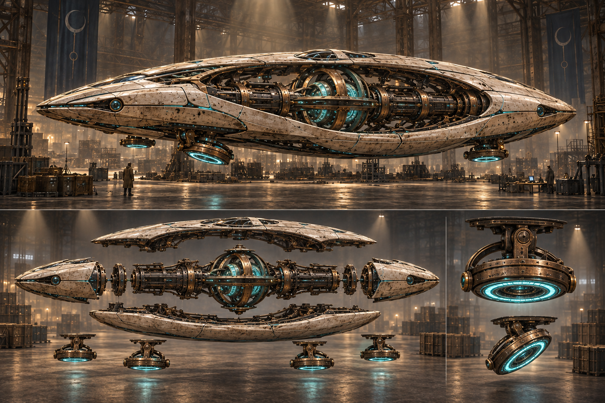

# Restore: discovering what the objects belong to

Prototype checkpoint: the first office, tool and clue chains and a 24-part mechanism are now implemented on `opening-discovery`. See [current implementation and limits](../OPENING-IMPLEMENTATION.md). The broader design below remains the target.

Working design, 10 September 2026. Confirmed direction: relaxed discovery with key milestones, short authored escape-room puzzle chains and freedom to explore several leads in different orders. The player does not know it is a ship when the game begins. Concept and planning only; ship assembly and the new room/tool puzzles are not implemented in the live demo.

**Internal design reference with spoilers.** The completed-ship image below guides production. It must not appear in the opening, loading screen, initial room, early guidance or promotional material intended to preserve the discovery.

The player enters a small office beside the warehouse entrance: desks, stacks of workbooks and logbooks, and lockers. A pair of unfamiliar gauntlets waits in one locker. Wearing them reveals a new way to lift and handle the strange objects in the archive beyond. At first, restoring something beautiful is enough. Then two independently discovered objects connect. A mechanism begins to move. Different finds reveal a common origin. Only after the player has built enough real structure do they realize that these objects belong to a ship.

That recognition is a major reward of play. The experience begins with curiosity and physical discovery, without a stated spacecraft objective, a visible ship frame or a completed silhouette to copy. Once recognized, the emerging ship becomes the room's central landmark, and finishing it gives earlier discoveries new meaning.

## Current ship direction: an elongated antigravity saucer

Preserve the internal design the user likes: an aged copper and bronze spine, exposed gyroscopic machinery, branching conduits and sweeping ivory ceramic panels. Wrap those structures in a broad, flattened oval saucer, roughly twice as long as it is wide, with a low lenticular perimeter and gently rounded taper at both ends. An open central inspection well exposes the retained bronze keel and gyroscopic core. A shallow forward observation space follows the hull rather than projecting as a pointed nose, and navigation elements sit within the rim. The visual interest comes from the layered shell and visible machinery between its surfaces.

The craft uses fictional antigravity technology with vertically mounted thrusters that can rotate. A provisional arrangement places four compact gimbaled vector pods beneath the rim in front and rear pairs, separated around the central mechanism. Bronze gimbal yokes support shallow downward-facing ring emitters. In their neutral position, each pod's thrust axis points vertically downward. The gimbals tilt the pods to direct force forward, backward or sideways, then return to a vertical resting orientation. These are shallow ring-and-lens mechanisms, without large rear-facing rocket bells, long exhaust nozzles or tail engines. Their number and placement remain blockout decisions rather than fixed user requirements.

The gyroscopic core supplies the fictional lift field; the smaller rotating pods visibly direct and balance it. Their housings, pivots, stops, flexible conduits and mounting arms must form a plausible assembly with clearance throughout the intended rotation. Before recognition, the same parts can read as unfamiliar precision instruments. After recognition, coordinated tilt and changes in the craft's apparent weight explain their purpose without text or fiery exhaust.

Concept 02 is the current external direction. It remains a visual hypothesis, not mechanically consistent production geometry. We still need top, side, front and underside drawings to settle the oval silhouette, shell thickness, pod spacing, gimbal clearances, support structure and access. Start the blockout around a provisional 24 m length, 13 m width and 5 m overall height including the suspended machinery; verify those dimensions against the actual warehouse and player reach before locking them. These are design proposals, not real spacecraft engineering.

[Concept 01](restore-ship-concept-01.png) remains a historical reference for the internal material and machinery language. Its pointed nose, tall dorsal fin and twin rear rocket engines are superseded; do not carry that external silhouette into production.

The ship should look intentional when complete and interesting as individual objects on a table. Its identity should emerge through meaningful assembly. Early pieces need enough ambiguity to plausibly belong to unfamiliar instruments, sculptures or machines.

## Opening: a place where people worked

Build a few human-scale rooms inside the enormous warehouse: the front office, a nearby restoration workshop and a records room. The contrast makes the warehouse feel larger and gives the player somewhere comfortable to inspect discoveries. Workbooks and logbooks supply physical detail and optional isolated sketches, rubbings and recurring marks. They never contain a complete ship drawing. One notebook inside a desk drawer contains a sticky note with the combination to an old 1950s-style metal briefcase. Its grainy photographs provide clues about individual objects and places. This short written code is a deliberate physical puzzle clue; lengthy narrative reading and scene instruction panels remain unnecessary.

The gauntlets are an early equipment discovery in an accessible locker. Nearby handles and light props remain usable barehanded, and movement remains available. Putting a glove on a wrist enables that hand's powered lifting, pulling and reconstruction. Either hand can go first; one glove is enough to play. Donning must work while holding controllers and from a seated position, without requiring precise finger insertion. A player may investigate the case or find the workshop's bolt cutters before equipping a glove.

Offer a nearby object for the first powered lift and two complementary pieces for the first local fit. Compatible edges respond with a little light and a quiet spatial tone. Assistance strengthens near correct alignment and ends in a physical seating motion. There is no visible influence sphere, global ghost or schematic that reveals the ship. This is an invitation to experiment, not a locked tutorial sequence: the player can explore the warehouse before finding the gloves.

The [office and gauntlet design](restore-office-and-gauntlets.md) contains the opening concept image, room layout, equipment interactions, sound sequence and accessibility requirements. These spaces and equipment systems are proposed, not implemented.

## Escape-room structure with parallel leads

Three initial branches share the same open office/workshop/warehouse area: locker to gauntlets to powered handling; drawer to notebook to sticky-note combination to briefcase photographs; workshop to bolt cutters to larger shipping containers. The photographs can suggest useful components and recognizable container details without being a prerequisite to using tools or installing parts. Accept a correct combination even if its clue has not been picked up.

Keep physical gates concrete. Bolt cutters release a visible sacrificial fastener on a large metal container, after which the player operates its door bars. Wooden crates remain breakable; reinforced container shells and the integrated briefcase lock resist powered destruction. Opening containers reveals larger rails, shell sections and support structures packed at canonical ship scale. Check door clearance and removal paths before assigning contents.

Small mechanisms and larger structural finds eventually connect, giving the game a guided progression without prescribing every discovery. Only actual access, tool capability and physically justified assembly prerequisites constrain order. The [tools and puzzle progression plan](restore-tools-and-puzzle-progression.md) records the dependency graph, photo direction, lock and cutter interactions, sound, saves and first playable scope.

## Discovery milestones

These follow things the player does and understands. Short physical puzzle chains create local order; these larger milestones are not countdowns, arbitrary crate quotas or a prescribed checklist. Let players linger, explore and work on several assemblies. Save milestone progress so returning never requires repeating a reveal.

| Milestone | What happens | What the player learns | Reward and next invitation |
|---|---|---|---|
| First response | Restore an unfamiliar object; it makes a small sound or its inner detail shifts | These objects still have something inside them | A satisfying material response and a subtle sign of life |
| First connection | Two separate finds share a physical key; their patterns and tones resolve when joined | Some of these objects belong together | A convincing latch and a new small movement or light |
| Working mystery | Several parts make a self-contained mechanism with moving rings or a suspended element | I can bring an unknown machine back to life | A persistent quiet sound layer and a clue that resonates with other finds |
| Shared structure | Two seemingly independent mechanisms attach through a larger frame or conduit | This is part of something much bigger | A wider work area becomes useful and several assembly paths remain available |
| Recognition | The connected shell gains an enclosed forward space, an elongated oval perimeter and coordinated downward-facing machinery | This is a ship | A coherent system response confirms the player's inference; no text announcement is needed |
| Awakening | Remaining critical systems come together and activate in sequence | The pieces I found have restored the whole machine | Sound, light, moving mechanisms and a change in apparent weight provide the final payoff |

Finding and wearing the gauntlets precedes these artifact milestones, with its own small tactile and sonic payoff. The first moments should be rewarding even if the player has no theory about the objects. The recognition milestone should grow from assembled form and behavior, not a sudden diagram that supplies the answer. If someone guesses early from genuine clues, let that be their discovery; do not contradict them or hide a valid connection to force the schedule.

## Protect the opening mystery

- Start in the office with workbooks, logbooks, the locked photo case and lockers, then lead naturally to crates, neutral tables and a few intriguing objects. The early photos show components and local clues, not a complete craft. Keep documents free of complete ship drawings. Do not expose a ship-shaped cradle, empty sockets arranged in a complete silhouette, or a giant chassis waiting to be filled.
- Keep explicit names such as engine, cockpit, thruster and navigation in development data. Early player-facing language, including accessibility descriptions, should describe shape, material and observed behavior without naming the final purpose.
- Use local mating edges, matching patterns and restrained positional sound as clues. Never show a global ghost of the completed ship during the mystery phase.
- Early activations use ambiguous resonance, rotation, suspended weight and moving light. Reserve coordinated directional pod movement and an unmistakable whole-craft hover until recognition. Avoid rocket exhaust as a visual or audio cue.
- Place the first few complementary finds deliberately within easy exploration range. Distribute more revealing shells and larger structural relationships later in the exploration space, without making completed work disappear or hiding already-found parts.
- Preserve the mystery in title art, loading screens and beginner-facing screenshots. Completed-ship concept art is an internal or deliberately spoiler-marked reference.

Relaxed discovery means no time pressure or punishment for trying a wrong fit. Gentle contextual clues can become a little clearer when someone is stuck, while leaving them free to investigate elsewhere.

## Build the finished ship before scattering it

1. Lock the silhouette with a simple complete 3D blockout. Walk and teleport around it in VR. Confirm that the underside, gyroscopic cavity and all four provisional vector-pod mounts are accessible, including their full rotation paths.
2. Divide the provisional design into ten major assemblies, including four independently buildable vector pods. Give each a coherent internal purpose, exterior shape, supporting frame and physical mounting interface. Its function can remain ambiguous to the player until enough context is assembled.
3. Break those assemblies into meaningful components at designed seams: plates, ribs, ring sections, housings, cassettes, manifolds and lenses. Tiny bolts and surface detail belong to larger components rather than becoming separate collectibles.
4. Record each component's exact assembled transform and connectors in one authoritative blueprint. Check the complete ship for gaps, intersections and unreachable installation paths.
5. Generate crates and larger shipping-container packing around the components' real dimensions. Store a packing pose when a long part fits diagonally, and validate container-door clearance and removal paths. A ship component must never change scale merely to fit a random crate.
6. Only then distribute components into the warehouse. Randomization changes their locations and surface wear while preserving dimensions, connections, solvability and the opening discovery sequence. Validate revealing combinations as well as individual part placement.

This is authored assembly with procedural production. Lathe profiles can produce shallow field rings, collars, lens housings and spindles; swept sections can form rails and oval hull ribs; shaped extrusions can form ceramic shell panels and gimbal brackets. Particularly important silhouette pieces may need deliberately modeled meshes. A geometry recipe still needs a designed form and tested connections.

## A concrete 240-component target

These are internal subsystem names and proposed content counts, not player-facing objectives or quotas. They are not a requirement to fill with repetitive pieces. Activation effects happen when the corresponding system and discovery context are ready; an early anonymous mechanism does not expose a vehicle silhouette or a coordinated whole-craft hover.

| Internal assembly | Components | Physical forms | Eventual completion response |
|---|---:|---|---|
| Central spine and structural mounts | 32 | Long rails, bulkheads, branching conduits | A faint power pulse travels along the frame |
| First crescent shield assembly | 40 | Curved ribs and broad ivory panels | A continuous illuminated seam appears |
| Second crescent shield assembly | 40 | A complementary curve with distinct mating edges | The ship's silhouette becomes complete |
| Reactor and gyroscopic suspension | 36 | Rings, spindle, bearings and crystalline core | Rings align, then begin a slow rotation and deep hum |
| Forward observation space and sensor housing | 28 | Shallow curved shell, lenses and inset navigation elements | Interior light and a quiet scanning response |
| First ventral vector pod | 12 | Compact ring, field lens, pivot frame and keyed mounts | Its field lens wakes and the gimbal makes a restrained calibration movement |
| Second ventral vector pod | 12 | Matching mechanism with a distinct mounting key | Its tone joins the first in harmony |
| Third ventral vector pod | 12 | Related ring and bearing assembly | Another local field responds; coordinated vehicle behavior waits for recognition |
| Fourth ventral vector pod | 12 | Final compact gimbal and field assembly | The complete array aligns downward and can demonstrate controlled tilt after recognition |
| Rim sensor and navigation assembly | 16 | Low perimeter inserts, lenses and conducting elements | A final signal connects the ship's systems |
| **Total** | **240** | | |

The four 12-component pods reuse an underlying geometry recipe while preserving explicit mounting keys and part identities. A candidate pod breakdown is a mounting saddle (1), gimbal frame halves (2), bearing/axle blocks (2), field-ring segments (3), emitter cassette (1), field lens (1) and flexible conduit housings (2). This totals 12 meaningful pieces per pod and keeps the former 48-part propulsion allocation without creating four large rocket engines. Validate whether repeating this mechanism is enjoyable before committing to all four as separate construction tasks.

Most components should be comfortable to handle as approximately 0.3–1.5 m objects. Larger frames use the gravity pull and assembly cradles. Surface decoration creates apparent complexity without adding hundreds of little tasks.

## The player loop

**Discover.** Open a crate and reveal a component or a small set of related components. Use recovered bolt cutters to release larger shipping containers containing broad shells, rails and frames. Photographs can suggest places or matching details without being required discovery flags. Exposed edge shapes, materials, repeating motifs and connector designs suggest their family. Early discoveries should have nearby complementary objects whose mating edges are readable, rather than empty destinations outlining the finished ship. Later warehouse bays mix families and introduce rarer missing pieces.

**Inspect and repair when needed.** The worn gauntlet supplies remote manipulation, magnetic repair and local connection assistance while preserving existing distance, weight and collision rules. Many parts are intact and can be installed immediately. Some have several damaged sections to recover using Restore's existing magnetic repair. Repairing every single discovery would make the loop repetitive. Loose pottery and nonessential relics can remain occasional discoveries, but required ship components must be reliably recoverable.

**Build a manageable mechanism.** Assemble an unidentified group on a neutral, height-adjustable work cradle. Its role as part of the lift-field core, a vector pod or a sensor becomes clear later. Accept compatible pieces in several valid orders. Require prerequisites only where they make physical sense, such as installing an internal core before closing its housing.

**Connect larger discoveries.** Completed mechanisms can fit other discoveries or an emerging structure, making their shared origin apparent. Before recognition, show only the nearby physical relationship. After recognition, pulling a completed module into its ship mount becomes an explicit restoration goal. Alignment assistance eases it into place, and a completed system adds a visible or audible response.

**Follow the next clue.** A newly moving object reacts to another find; a partial conduit lights up; a quiet directional tone suggests a compatible nearby component. Early clues show relationships without explaining the machine's purpose. These are proposed nonverbal clues. The scene retains the current preference for no instruction panels, headlines or floating labels.

## Repair and installation are different successes

Repair reunites broken fragments into their original component. Installation connects that complete component to another part of the ship. A repaired component's crate/home pose and its ship destination must be separate data.

The existing repair snap cannot simply treat the ship as one enormous broken object. That would lose module structure, accept bad construction order, and make every loose piece search against hundreds of unrelated destinations.

For installation, connectors define compatible types, keyed orientation and a specific allowed destination or interchangeable slot family. Initially try an assisted capture distance of 10–15 cm and a generous orientation window, then tune on the headset. A correct fit starts with a quiet resonant response and a localized light at the socket. Close alignment produces gentle pull, rotation assistance, a mechanical seating movement and the final latch sound. A wrong part remains movable and gives ordinary contact feedback.

Maintain solid movement against floors and neighboring parts. Final alignment must test the travel path and occupied space, rather than teleporting geometry through an obstacle. Successful installations use the exact blueprint pose rather than accumulating the player's placement error. Clearly mirrored components should have visibly different physical keys; identical replaceable pieces should genuinely fit multiple compatible slots.

Allow deliberate removal using a sustained grab-and-pull or a simple undo. Ordinary incidental taps should not destroy hours of installed progress.

## Sound carries the assembly

| Event | Sound direction |
|---|---|
| Explore the office and equip a gauntlet | Paper, drawer and locker contact, then a close cuff latch and brief restrained awakening |
| Open the photograph case | Lock-wheel detents, latch release, lid hinge and dry photo-paper movement |
| Release a shipping container | Cutter contact and strain, fastener snap and falling metal, then heavy door bars and hinges |
| Discover a part | Its physical material sound, followed by a very restrained family signature |
| Lift and move | Existing pickup, mass-sensitive strain and quiet surface-specific scraping |
| Find a compatible socket | A subtle positional resonance that strengthens with alignment |
| Seat a component | Contact, sliding engagement, then a short latch; scale the body of the sound to its mass |
| Finish repairing a broken component | Keep the brief positive repair reveal |
| Complete a functional module | A distinct short startup sequence with moving mechanisms and a new steady sound layer |
| Complete the ship | Existing systems wake in sequence, finishing with a coherent ship-wide response |

No constant success chimes on every movement. Interior seating noises, housing resonance and tiny pauses between engagement and latching should make the machinery feel physical. Build the ambience from mechanisms the player has actually restored. Early sounds should deepen curiosity; coordinated propulsion tones and whole-craft movement arrive after the vehicle inference. Use low field resonance, smooth bearing motion and a controlled change in air pressure rather than combustion or rocket roar. A milestone response plays once when earned, while its quieter functional ambience persists. The first complete-game ending can be an awakening and lift from its cradle; flying the ship is a separate feature decision.

## Access in VR

The player begins in a human-scale office and nearby workshop with neutral work surfaces where small assemblies can be comfortably inspected. Locker shelves, glove pickup and donning must be reachable while seated, with an alternative shelf-supported one-handed route. Only as larger discoveries connect does a full-scale structure establish a central assembly area. Avoid revealing its eventual size and silhouette through the initial work supports. Cradles can raise, lower and turn. Use existing teleport and snap turn to move between work positions; these controls remain available before wearing the gloves. Provide stable service platforms for upper mounts. Do not make reaching over the head, crouching beneath the whole ship, climbing, or backing into crates mandatory.

Check both seated and standing play. A player should be able to examine the back of a module, find a dropped critical part, and clear a blocked socket. Long-distance selection for the gravity tool can move large modules, while the existing nearby destruction rule remains independent.

## Data and runtime design

The blueprint owns stable part IDs, recipe versions, material settings, canonical poses relative to their assembly, local connector poses, bounds and collision descriptions. A separate connection graph describes which pieces attach. A prerequisite graph describes installation order. Both are validated before assigning crate contents.

Track states such as packed, discovered, damaged, repaired, installed and removed. Track earned discovery milestones separately from physical assembly: removing a component should not make the player forget what they learned or replay its revelation. Derive milestone triggers from meaningful connections and capabilities, not elapsed time or crate counts. Save discoveries, earned milestones, repaired fragment groups, loose poses, installed connector assignments and module activation state. Reconstruct installed transforms from the blueprint on load. Keep blueprint/recipe versions in the save and design migrations before altering a published ship. Test refresh, interrupted saves and recovery of dropped critical parts. The existing global reset must not accidentally erase the new ship progression.

Save glove discovery, location and equipped-hand state separately from object and ship progression. Hand/controller switching must retain equipment ownership without duplicating gloves. Tracking loss cancels active pulling safely; regaining tracking must not cause an unintended grab. Keep basic touch interactions separate from hand-specific powered abilities, and preserve access to equipment without needing those abilities first.

Save the case combination/unlocked state, note and photograph identities/locations, reusable cutter location, cut fasteners and container door/access states separately from assembly progress. Keep clues readable and unique tools recoverable. A correct physical solution cannot depend on an invisible clue-read flag. Reloads, magnetic repair and ordinary resets must not reverse earned access or consume essential evidence. The progression graph must keep the initial case, glove and cutter branches independently reachable.

Unopened crates keep recipes and IDs. Generate detailed geometry only when revealed or needed near the player. Retain a bounded set of loose simulated objects; sleeping should preserve valid collisions, and distant objects should be stored or simplified rather than silently lost. Installed assemblies can combine rendering by material and use simpler fixed collision shapes. Preserve part lookup for selection and deliberate removal even when render batches change.

Avoid hundreds of permanent rigid-body joints. Structural installation is a validated snap followed by a fixed blueprint relationship. Restrict physics to loose components, held assemblies, debris and genuinely moving mechanisms. Installed pod gimbals use explicit constrained pivots and authored calibration motion; the first slice does not require flight simulation or a live thrust solver. Preserve the canonical mounting transform separately from each pod's current tilt, and check shell and neighboring-pod clearance across the allowed motion. Reuse material maps and shader programs, use distance-based detail for the completed ship, and avoid preparing fracture meshes for every unopened component.

An initial investigation target is 24–32 actively simulated loose components in the work area and 72 Hz on the target headset. These are provisional budgets, not measured guarantees. Profile the actual field-mechanism slice with warehouse atmosphere and postprocessing enabled before choosing full-ship geometry and debris limits.

## First playable slice: a working mystery

First establish the office desk drawer, notebook and combination note, locked photo case, glove locker, nearby workshop cutter rack, one secured shipping container and a few complementary objects. Validate case-first, gloves-first and cutters-first exploration, including code entry, equipment handling, the first powered lift and local alignment cues before populating the larger mechanism. The records room can follow once this opening works. Physical clue digits are allowed; no scene instructions or complete ship reference are needed.

Build a 24-component anonymous field mechanism that will eventually form the inner portion of the 36-component reactor and gyroscopic suspension assembly. Its breakdown is a field cradle and bulkhead (2), structural ring frames (2), radial supports (4), emitter cassettes (6), ceramic curved segments (6), fluid manifolds (2), collar and field lens (2). These are a subset of the full 240-component blueprint, not 24 additional parts and not one of the 12-component vector pods. The prototype presents them as unfamiliar objects. The remaining reactor housing, saucer mounting context and whole-craft lift behavior arrive later.

Place the parts in roughly 8–12 nearby crates. Let most arrive intact and make two components require repair. The first several finds establish the first response and first connection; the remaining set builds toward a working mechanism. Use a neutral work cradle whose shape does not imply a larger vehicle.

Completion produces a slow ring alignment, suspended inner element and richer resonant sound. It can react to one additional find that clearly belongs to something else. End the slice with an intriguing larger question instead of answering it with a spaceship reveal.

Test with people who have not seen the concept. They should be able to discover a connection, enjoy bringing the mechanism to life, try different valid assembly orders, handle wrong fits, repair damage, remove a mistake and resume later. Ask what they think the objects are and what led to that interpretation. Improve any cues that reveal the ship before relationships become interesting; an individual insightful guess is not a failure.

Separately test obstructed sockets, floor contact, interchangeable parts, two-hand ownership, reach and sustained frame time. Include seated and one-handed donning, case/cutter use, controller/hand-tracking switching, dropped essential tools/clues, saved equipment/access state and clear passage through the small rooms and container doors. Test correct solutions found before their clues, and photographs discovered after the objects they depict. The slice should prove that curiosity and the physical payoff work before scaling up to the full reveal.

## Production sequence

1. Review concept 02 and create a consistent turnaround. Settle the elongated saucer silhouette, preserved internal machinery, shallow shell and vertical rotating-pod arrangement. Verify the gimbal clearances in blockout.
2. Build and inspect the complete low-detail ship in a development view. Author module boundaries and accessible work positions, then create a separate player start that conceals the complete silhouette.
3. Build the office's notebook/case puzzle, glove discovery, workshop cutters and one secured container; validate different exploration orders and the first lift/fit. Then finish the anonymous 24-part mechanism, connector rules, neutral cradle and saved milestones. Playtest discovery through its first functional response with players who have not seen the ship. Add the records room once the opening proves useful.
4. Produce a 60–80-part connected set to test parallel assembly, shared-origin clues and the transition from a working mystery to recognizing a vehicle. Let actual geometry and behavior carry the reveal.
5. Expand toward 240 only if each module contributes a new silhouette, interaction or functional payoff. Author the remainder as connected complete assemblies, then populate the warehouse from the validated blueprint.
6. Profile, simplify and verify the full experience on the headset. Calibrate the soundscape after the real assembly timing is established.

Existing foundations: crate discovery, grabbing, constrained motion, material sounds, teleport/snap turn, component fracture/repair and completion feedback. New work: interior rooms, interactive doors/drawers/lockers/books, code clue and photograph case, reusable cutters and secured shipping containers, wearable gauntlets and equipment state, the actual ship, connector matching, rotational placement assistance, assembly ordering, nonverbal discovery milestones, work cradles, persistent progress and full-scale content management.

Generation provenance and the exact current concept prompt are saved in [restore-ship-concept-02-prompt.md](restore-ship-concept-02-prompt.md). The [original generation record](restore-ship-concept-01-prompt.md) documents the superseded external direction. These images are internal art references and are not placed in the app's downloaded runtime assets.

The separate [opening concept and gauntlet plan](restore-office-and-gauntlets.md) is suitable for discussing the first room without showing the completed ship. Its [generation record](restore-office-gauntlets-concept-01-prompt.md) preserves the exact prompt.
