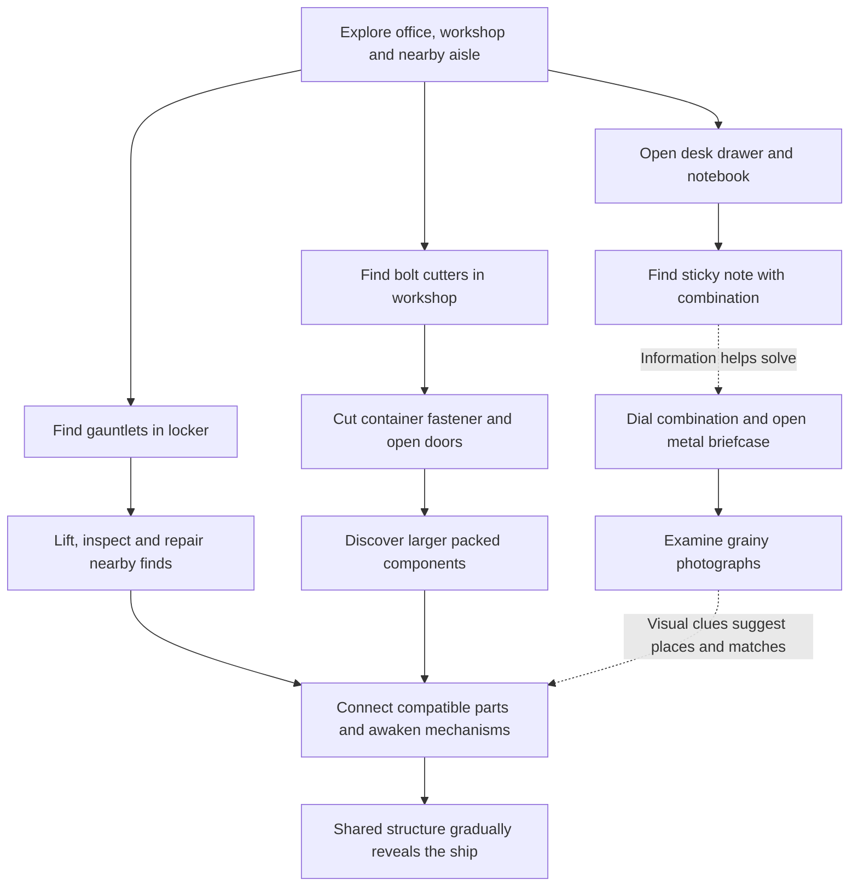

# Restore: tools, clues and an open warehouse mystery

Prototype checkpoint: the first office, tool and clue chains and a 24-part mechanism are now implemented on `opening-discovery`. See [current implementation and limits](../OPENING-IMPLEMENTATION.md). The broader design below remains the target.

Design addition, 10 September 2026. The user wants a relaxed escape-room structure with some authored sequences and freedom to explore or solve different branches in a different order. Specific additions: bolt cutters open large shipping containers holding larger parts; grainy photographs sit in an old 1950s-style metal briefcase in the office; its combination is written on a sticky note inside a notebook in a desk drawer. This is a design plan, not implemented gameplay.

## A few dependencies, several things to investigate

The warehouse is a place to explore, handle objects and discover connections. A few physical prerequisites give that exploration direction: a combination releases a case, a tool releases a container, and connected parts bring a mechanism to life. Keep these short chains understandable while allowing the player to switch between them.

At the start, the office desk and briefcase, glove locker, workshop and nearby warehouse aisle are accessible. The first gauntlet, bolt cutters and combination clue must not sit behind one another's gates. Finding photographs should help someone investigate the collection; it should not be a hidden requirement for using equipment or installing a correct part.

The dotted links represent useful information, not software locks. A correct combination works even if the player has not opened the notebook. Recognizing a part or finding a container without seeing its photograph remains a valid solution. The gauntlets are needed for powered manipulation of heavy finds, but the case and cutters can be used before equipping them.

## The office combination puzzle

Place the closed metal briefcase on a reachable desk or low cabinet, visible from the entrance without dominating the whole room. Use a worn metal shell, rounded corners, a carrying handle, tactile latches and a mechanical combination lock. The 1950s-style case is an art direction, not a requirement for strict historical reconstruction.

The clue chain preserves the user's arrangement exactly:

1. Open the desk drawer. A notebook lies inside among ordinary office materials.
2. Open the notebook. A sticky note is tucked between its pages, with an edge visible enough to invite handling.
3. Read the handwritten combination. A small sketch of the case's latch or a matching distinctive mark associates it with this lock, avoiding an arbitrary guess about what the numbers mean.
4. Turn the briefcase's combination wheels to match the note, then deliberately operate the latch.
5. Open the lid and take out a few grainy photographs.

Propose four large, well-spaced numeral wheels, with the final code chosen during blockout. Use one stable code for the first prototype. If later versions randomize it, the physical note, dial validation and saved world must share one stored value. Do not hide success behind a separate `clueSeen` flag. Wrong codes leave the latch mechanically closed with a quiet dry contact sound; no alarm, penalty or timer.

The notebook can be set beside the case with the note still visible. Opening it again returns to the marked page. Numbers must be comfortably readable on the headset: clear strokes, adequate contrast and no ambiguous 6/9 orientation. A physical close-inspection pose and optional accessible readout can help without adding floating instructions. The note is a deliberate exception to the earlier no-text direction: real puzzle writing and lock numerals are allowed. Headlines, HUD labels, instruction panels and lengthy required reading remain absent.

The case stays unlocked after the first success. Closing the lid is safe and does not erase progress or require solving it again. Ordinary handling cannot accidentally scramble an open lock into a progression reset.

## Photographs that become meaningful later

The photographs are evidence of handling and studying these objects, and useful visual clues. They should not immediately answer what the objects collectively form. Their grain, faded contrast, bent edges and fingerprints give them age, while the important shapes stay legible.

| Proposed photograph | Useful clue | What it conceals |
|---|---|---|
| A close photograph of a segmented ring on a workshop table | The same distinctive groove and connector shape appear on nearby finds | Its place in the whole craft |
| A partially uncrated bronze bracket beside a recognizable container fastener and mark | A visual lead toward the first large shipping container and a sense of component scale | A full hull or saucer outline |
| A hand wearing a gauntlet beside two joined ceramic edges | Connects the equipment to careful restoration and shows a local mating relationship | A universal assembly solution |

These are proposed subjects, not final generated photo assets. They can be found before or after the objects they depict. Seeing a previously mysterious photograph make sense is a reward in either order. Keep each picture fixed; do not silently replace its contents when a milestone is reached. If a later photograph shows the whole craft, place it later in the world rather than including a visible complete ship in this first case.

The photos may be carried, laid out on the workshop bench or stored in the case. They are not consumed when used. Once recovered, they must remain reachable after reload or recovery of a misplaced prop.

## Bolt cutters and larger shipping containers

Place the bolt cutters on a reachable workshop tool rack or in an unlocked low tool cabinet. Their jaws, handles and wear explain their physical use. A nearby shipping container has a clearly exposed sacrificial chain link or narrow locking keeper securing its door bars. This is the authored cutting target; the player is not expected to cut the container shell.

Bring the open jaws around the target, then close the handles. A generous capture region helps align the tool while preserving visible contact. Two-handed operation can be satisfying, but one-handed play must work: once the jaws are seated, a deliberate squeeze can complete the handle motion. Controllers stay in the player's hands. There is no rapid button mashing, required grip strength or overhead reach.

Give the action a short physical sequence: jaws settle against the metal, the fastener flexes with a strained creak, a sharp cut releases it, and the loose metal hits the door or floor. The latch and heavy door then provide separate clunks, creaks and a larger interior resonance. Do not make every cut a loud celebratory sound. Tune the result against the established quiet interaction mix.

Cutting releases the lock but does not fling the doors open. The player turns or lifts the bars and draws the doors through their valid swing. Protect against blocking the player or trapping a required part behind a door. Allow comfortable reach and keep the container's approach clear enough for its largest packed component to exit.

Ordinary wooden crates retain destruction. Large metal shipping-container shells, secured door bars and the reinforced briefcase resist it, giving the cutters and combination separate roles. The case has an integrated latch with no exposed cutter target; containers have a distinct sacrificial fastener. Powered pulls can strain a secured door but cannot move its contents through a closed wall or target hidden pieces through it. The designated fastener can be cut; only released doors can swing. Use visible metal construction and matching contact sounds to communicate this distinction. Do not add an arbitrary range or tool level requirement on top.

The cutters remain reusable and can open more than one container. Opening the case or restoring an unrelated mechanism is not required to make them work. Each released container keeps its cut/unlocked state. Magnetic repair should not reseal its fastener, and a normal scene reset must not reverse earned access.

## Large parts need larger packing and assembly space

Shipping containers hold the larger rails, broad ceramic shell sections, long conduits and complete support frames that do not fit ordinary crates. Contents come from the actual ship blueprint at their canonical size. Measure a part's packing pose, hatch clearance, door swing and removal path; do not shrink an essential component to fit a chosen container.

Place initial large finds deliberately. Their separate shapes can remain ambiguous, while a later combination makes the saucer recognizable. The photos can point toward a distinctive container mark, but other observation and exploration can find it too. Avoid dozens of near-identical locked doors around the first cutter puzzle.

A closed container stores part recipes and packing transforms. Detailed geometry and active physics should be prepared as its interior becomes visible or relevant. Large static shells use simple colliders; sleeping doors and resting parts should settle. Opening one container must not activate the entire warehouse. Build exposed contents predictably so opening a door does not cause overlaps, explosive settling or an obstructed exit.

## What guides the order

There are three types of dependency, recorded separately:

| Dependency | Example | Rule |
|---|---|---|
| Physical access | A secured container door needs its fastener cut | Model the visible mechanism and persist its released state |
| Tool capability | A large component needs powered lifting | One equipped glove enables the action; do not also require an unrelated clue event |
| Assembly geometry | A core must fit before its enclosing shell | Require only construction order justified by the real shape and connection |

Knowledge is different. Notes and photographs help the player understand where or how to act, but do not forbid correct actions discovered independently. Keep two or three useful nearby leads available as a layout goal, without a quest list that tells the player which to finish first. Doors already opened and mechanisms already restored remain available for revisiting.

Any future tool should add a recognizable physical action with more than one useful application. A portable inspection lamp is a possible later option for dark recesses, not a new mandatory gate for the initial slice. First prove the gauntlets and bolt cutters before adding an inventory of single-use keys or specialist devices.

## Persistence, recovery and VR handling

Store briefcase code and unlocked state, dial positions, notebook page/note location, photograph locations, tool locations, glove equipment, cut fasteners, container locks and door angles independently of the ship connection graph. Save meaningful completed interactions atomically so reloading around a cut or latch cannot duplicate tools, relock access or lose contents. Milestone knowledge remains separate from the current position of physical objects.

Tools and clues cannot become irretrievable progression blockers. Use collision-safe held movement and accessible placement surfaces. Recover unreachable essentials to a predictable office case, desk or workshop rack; leave ordinary accessible dropped objects where the player put them. Recover the same object ID rather than spawning duplicates. Destructive interactions must preserve or recover the notebook's clue, the photos and unique tools. No limited cutter durability or consumable clue items.

Support seated reach, either hand and one-handed operation for drawers, notebook pages, dials, case latch, cutters, door bars and container doors. The player can place the case, notebook or tool on a stable surface to operate it. Accept controller and tracked-hand interactions without requiring two continuously tracked hands. Loss of tracking must safely stop force and tool closure, not cut unexpectedly or throw equipment.

## First playable and acceptance checks

Start with one office desk drawer, one notebook and its sticky note, one four-wheel case with three photos, an unlocked glove locker, a workshop cutter rack, one secured shipping container and a few complementary objects. Keep the planned 24-component anonymous field mechanism as the next assembly target, after the short access and handling interactions work. More rooms, container gates and tools come after this loop proves rewarding.

Test the experience in at least three orders: case first, gloves first, and cutters/container first. Each should remain solvable, and correct actions should work without checking a narrative sequence flag. Verify a correct code entered before finding the note, wrong codes without punishment, photographs found after their subject, and a large component removed only after a physically clear door opening.

Test reloads before and after cutting, unlocking, taking photographs and equipping tools. Verify dropped/recovered essentials, closed-container selection, gauntlet/destruction resistance, magnetic repair near a released fastener and ordinary resets. Test seated, one-handed and mixed input play, plus bounded physics activation and headset frame time when a large container opens.

Blind playtests should show that players understand the short clue chain, can pursue another lead when stuck, and begin to connect discoveries without being told it is a ship. A player guessing the craft early from actual evidence is allowed; the opening should avoid handing them its complete image.

Related: [office and gauntlets](restore-office-and-gauntlets.md), [ship assembly and discovery plan](restore-ship-assembly-plan.md). The latter contains internal ship spoilers.
